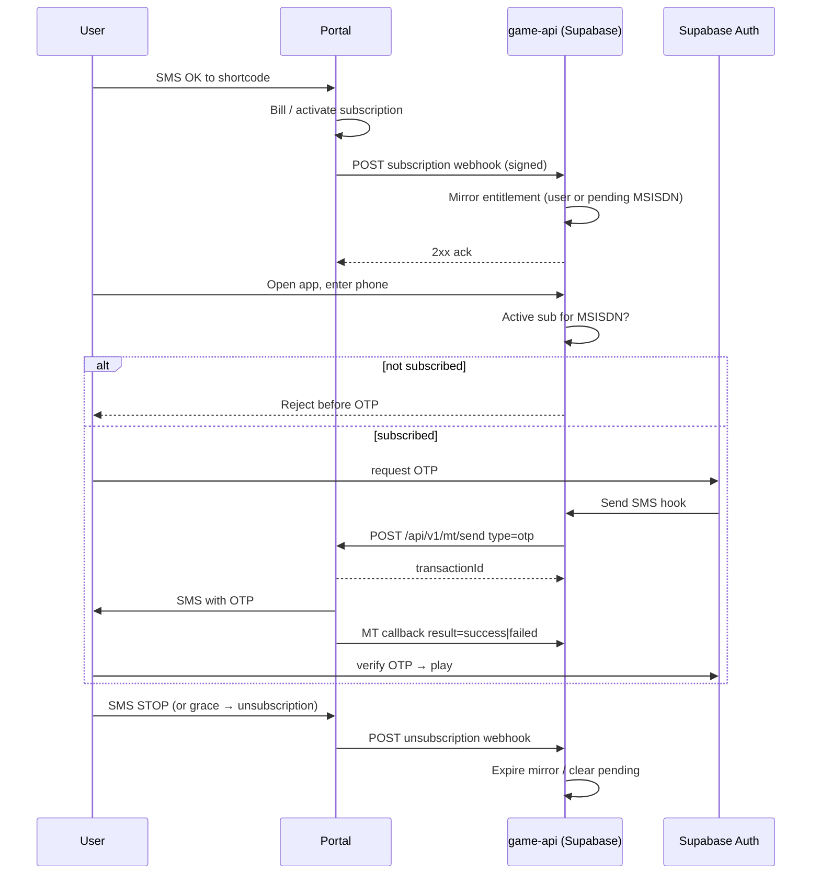

# Subscription Portal Integration Plan

**InnoArcade (game-api) ↔ Partner Messaging & Notification API (MT + webhooks)**

| | |
|---|---|
| **Target role** | Partner / service provider on the portal |
| **Identity** | MSISDN digits `2519…` (store as E.164 `+251…` internally) |
| **API contract** | [`partner-mt-and-webhooks.openapi.yaml`](../partner-mt-and-webhooks.openapi.yaml) (v1.0.0) |
| **Default backend (go-live)** | Hosted Supabase — Edge Functions + Postgres |
| **Contingency backend** | Self-hosted PostgreSQL + application API (see §8) |
| **Status** | Phases 1–3 **implemented** (2026-07-15); deploy Phase 3 + portal credentials / `serviceId` map still required |

---

## Contents

1. [Executive summary](#1-executive-summary)
2. [Go-live backend decision](#2-go-live-backend-decision)
3. [Target architecture](#3-target-architecture)
4. [OpenAPI contract (locked)](#4-openapi-contract-locked)
5. [Gap analysis — OpenAPI vs our system](#5-gap-analysis--openapi-vs-our-system)
6. [What we still need from the portal owner](#6-what-we-still-need-from-the-portal-owner)
7. [Where and how to integrate](#7-where-and-how-to-integrate)
8. [Detailed implementation plan](#8-detailed-implementation-plan)
9. [Portal handoff — request vs provide](#9-portal-handoff--request-vs-provide)
10. [Contingency: Supabase → self-hosted PostgreSQL](#10-contingency-supabase--self-hosted-postgresql)
11. [Risks](#11-risks)
12. [Recommended next steps](#12-recommended-next-steps)
13. [References](#13-references)
14. [Discovery log — portal owner calls](#14-discovery-log--portal-owner-calls)

---

## 1. Executive summary

InnoArcade integrates with a **partner messaging & notification API** that owns SMS MT delivery and subscription lifecycle notifications. We register as a **partner with one or more services** (`serviceId`); the portal bills users and notifies us; we mirror entitlement and gate play.

**Current state:** scaffold deployed (webhooks, pending MSISDN, portal-gated subscribe) but parsers/clients still assume a generic “template generate-send” API — **not** the real OpenAPI.

**Target state (from OpenAPI + prior call):**

| Flow | Direction | Contract |
|---|---|---|
| Subscription / unsubscription | Portal → us | Signed webhook (`event`, `request_id`, `service_id`, `msisdn`) |
| Send MT (OTP / welcome / business) | Us → portal | `POST /api/v1/mt/send` + `X-API-Key` |
| MT delivery final status | Portal → us | Unsigned (per OpenAPI) callback to our `callbackUrl` |

**Player client rule:** the Vite hub never talks to the portal — only Edge Functions do.

| Work item | Count |
|---|---|
| Rebind outbound client to `/api/v1/mt/send` | 1 |
| Align subscription webhook parser + HMAC | 1 |
| Align MT status callback (retarget `portal-sms-dlr`) | 1 |
| `serviceId` → plan map | 1 |
| Subscribe-gated OTP | 1 (product-critical) |
| Remaining portal asks | credentials, serviceIds, sandbox, grace semantics |

---

## 2. Go-live backend decision

### Default path: stay on hosted Supabase (recommended for production go-live)

| Layer | Role today |
|---|---|
| **PostgreSQL** | ~40 migrations, views, RPCs, `pg_cron` settlement jobs |
| **PostgREST** | Client `.from()` / `.rpc()` reads |
| **Auth (GoTrue)** | Phone OTP, JWT sessions, `auth.users` → `profiles` trigger |
| **Edge Functions** | Server endpoints — economy, webhooks, cron, admin (`game-api`) |

There is **no separate Node API** today. Edge Functions *are* `game-api`.

**Production go-live checklist (Supabase path):**

- [ ] Production Supabase project (separate from staging `kuoxbflcxruwtgbjclet`)
- [ ] Apply migrations; deploy portal-related functions
- [ ] Set secrets (`PORTAL_*`, `SMS_MODE=portal`, `CRON_SECRET`, …)
- [ ] Disable `VITE_DEV_OTP_ECHO`; do not deploy `dev_otps` to prod
- [ ] Register portal notification URL + MT `callbackUrl` against **prod** function URLs
- [ ] Point Vercel `VITE_SUPABASE_*` at prod

### Contingency path: self-hosted PostgreSQL

If ops/compliance requires bare PostgreSQL, see **§10**. That is a **platform rebuild** — do **not** block portal integration on it.

---

## 3. Target architecture

### Role mapping

| Diagram role | System (Supabase) | Responsibility |
|---|---|---|
| Partner portal | Portal host (`168.119.53.26:8484` today) | Billing, SMS gateway, subscription SoT |
| **game-api** | Supabase Edge Functions + Postgres | Entitlement mirror, MT client, gated OTP |
| Player client | Vite hub (GoPlay) | Sign-in only if subscribed; never calls portal |

### End-to-end lifecycle (portal-first)



### MSISDN ↔ user linking

- **Happy path:** webhook MSISDN already in `profiles.phone` / `auth.users.phone` → activate `subscriptions`.
- **Cold opt-in:** no account yet → `portal_pending_entitlements`; claim on first OTP signup via `handle_new_user`.
- **Format:** portal examples use `251911000000` (no `+`); we normalize to `+251…` for storage and last-9-digit match for lookup. Outbound MT should send digits in portal form (`251…`).

---

## 4. OpenAPI contract (locked)

Source: [`partner-mt-and-webhooks.openapi.yaml`](../partner-mt-and-webhooks.openapi.yaml).

### 4.1 Servers & auth

| Item | Value |
|---|---|
| Server (documented) | `http://168.119.53.26:8484` (Production) |
| Outbound auth | Header `X-API-Key: <partner key>` |
| Inbound sub webhook auth | `X-Timestamp` + `X-Signature: sha256=<hex>` over `"{timestamp}.{rawBody}"` (HMAC-SHA256, UTF-8 secret) |
| Inbound MT callback auth | **Not specified** in OpenAPI — protect via HTTPS + unguessable path |

### 4.2 `POST /api/v1/mt/send`

**Request (required):** `serviceId` (int64), `msisdn`, `type`, `message`  
**Optional:** `extTransactionId`, `callbackUrl`  
**Types:** `optin` \| `optout` \| `business` \| `otp` (case-insensitive)

**Business rule (critical):** MSISDN must have an **active subscription for that `serviceId`**, or portal returns `400` / `MT_NO_ACTIVE_SUBSCRIPTION`. OTP therefore only works **after** we have been notified of subscription (portal-first is mandatory, not optional).

**Success `200`:** `data.transactionId` (UUID), echoes `serviceId`, `msisdn`, `extTransactionId`, `type`.

### 4.3 Webhook — subscription notifications

Portal POSTs to **our** configured notification URL.

| Field | Type | Notes |
|---|---|---|
| `event` | `subscription` \| `unsubscription` | Exact enum |
| `request_id` | UUID | Idempotency key (= `X-Request-Id`) |
| `service_id` | int64 | Map to our plan |
| `msisdn` | string | e.g. `251911000000` |
| `time` | ISO-8601 | Event time |

**Ack:** any `2xx`.

**HMAC steps (from OpenAPI):**

1. Read `X-Timestamp` and raw JSON body.
2. HMAC-SHA256 of `"{timestamp}.{body}"` with shared secret (UTF-8).
3. Hex-encode; compare to `X-Signature` after `sha256=` prefix (constant-time).

### 4.4 Webhook — MT delivery callback

Only when we pass `callbackUrl` on send. Final outcome only (no intermediate retries).

| Field | Type | Notes |
|---|---|---|
| `service_id` | int64 | |
| `msisdn` | string | |
| `ext_transaction_id` | string | Present if we sent `extTransactionId` |
| `result` | `success` \| `failed` | |
| `time` | ISO-8601 | |
| `reason` | string | When `failed` |

**Ack:** any `2xx`. No signature headers documented.

### 4.5 Explicitly **not** in this OpenAPI

| Missing area | Implication |
|---|---|
| Payment / renew / charge webhooks | Charging stays portal-side; lifecycle = `subscription` / `unsubscription` only (for now) |
| Template catalog | Free-text `message` — we build OTP / WELCOME copy |
| Grace-expiry distinct event | Likely arrives as `unsubscription` — **confirm** |
| Sandbox server URL | Only production server listed |
| Partner onboarding / service CRUD | Offline / portal UI |
| Rate limits / retry schedule | Ask ops |

---

## 5. Gap analysis — OpenAPI vs our system

### 5.1 Alignment matrix

| Capability | OpenAPI / product | Our system today | Gap |
|---|---|---|---|
| Outbound SMS | `POST /api/v1/mt/send` + free-text + `type` | `portalSendMessage` → `/api/v1/messages/generate-send` + templates | **Rebind client** |
| API auth | `X-API-Key` only | Sends `Bearer` + `x-api-key` | Drop Bearer; use `X-API-Key` |
| MSISDN outbound | `2519…` | We send `+251…` | Strip `+` on MT send |
| OTP message | `type: otp`, full `message` | Template vars (`PORTAL_OTP_TEMPLATE`) | Build message string; keep Supabase-generated OTP |
| Active-sub required for MT | Enforced (`MT_NO_ACTIVE_SUBSCRIPTION`) | Not checked before Auth OTP | **Subscribe-gated OTP** |
| Sub webhook event names | `subscription` / `unsubscription` | Accepts optin/start/subscribe/… | Prefer OpenAPI enums; keep aliases |
| Idempotency key | `request_id` | `event_id` / `eventId` / generated | Prefer `request_id` |
| Plan identity | `service_id` only | Parses `period`/`plan` from body | **`serviceId` → period map** |
| Sub webhook HMAC | `X-Timestamp` + `sha256=` over `ts.body` | Standard Webhooks **or** body-only HMAC | **Implement OpenAPI algorithm** |
| MT status callback | `result` success/failed + `ext_transaction_id` | Classic DLR (`DELIVRD`/…) | Retarget parser; correlate by `ext_transaction_id` |
| MT callback signature | None documented | Requires portal HMAC unless skip | Optional verify off for this route, or shared secret if they add later |
| Payment webhook | Not in OpenAPI | `portal-payment-webhook` stub | Keep dormant; do not block go-live |
| WELCOME / promo | Call `type: optin` or `business` ourselves | Template WELCOME on subscribe EF | After sub webhook, optionally MT `optin` |
| `sms_messages` statuses | `success`/`failed` | check constraint includes DLR enums | Add `success`/`failed` or map into existing |
| External id on sub | No subscription id in notify payload | Uses `external_id` from payload | Use `request_id` or `service_id+msisdn+time` |

### 5.2 Scaffold that still works (reuse)

| Asset | Path | Keep |
|---|---|---|
| Schema | `portal_events`, `sms_messages`, `portal_pending_entitlements`, subscription cols | Yes — extend, don’t rip |
| RPCs | `user_id_for_msisdn`, `claim_pending_portal_entitlements` | Yes |
| Webhook hosts | `portal-subscription-webhook`, `portal-sms-dlr` | Yes — fix parsers |
| Gating | `PORTAL_ENABLED` pending subscribe; cancel rejected | Yes |
| JWT off | `config.toml` for portal EFs | Yes |

### 5.3 Product contradictions to resolve in code

1. **MT requires active portal sub** → login OTP via portal only after webhook opt-in. Demo free-grant + portal OTP cannot coexist.
2. **No `period` on webhook** → entitlement period comes only from our `serviceId` config, not the payload.
3. **No payment webhook** → renewals are invisible unless they re-fire `subscription` or we treat absence of `unsubscription` as still active; expiry dates we invent may drift unless we set long/grace windows they define.

---

## 6. What we still need from the portal owner

Items **closed by OpenAPI** are marked in §9. Remaining asks (send as a short checklist):

### Must-have before sandbox integration

| # | Ask | Why |
|---|---|---|
| 1 | Partner **API key** (staging + prod) | `X-API-Key` for `/mt/send` |
| 2 | Webhook **HMAC shared secret** | Verify `X-Signature` |
| 3 | **`serviceId` values** for daily / weekly / monthly (and shortcode each maps to) | Plan mapping; MT `serviceId` |
| 4 | **Sandbox / UAT base URL** (OpenAPI lists only prod IP:8484) | Safe testing |
| 5 | Confirm notification URL registration (where we paste staging URL) | They must POST to us |
| 6 | Confirm **HTTPS** on portal + whether we must call HTTP IP as documented | Security / TLS |

### Should-have before go-live

| # | Ask | Why |
|---|---|---|
| 7 | Is **grace expiry** delivered as `event: unsubscription`? Any extra fields? | Mirror deactivation |
| 8 | Is MT delivery callback **signed** (undocumented)? Recommended path secrecy OK? | Secure `portal-sms-dlr` |
| 9 | Webhook **retry policy** (intervals, give-up) + our max ack latency | Idempotency + timeouts |
| 10 | **Timestamp skew** tolerance for `X-Timestamp` | Reject replay |
| 11 | Can one MSISDN hold **multiple** active `serviceId`s? | Schema: one open pending vs many |
| 12 | Who sends post-opt-in **promo / game URL** SMS — portal auto or us via `type=business`? | Avoid double SMS |
| 13 | OTP: confirm partner-generated code in `message` is OK (OpenAPI example supports this) | Matches our Auth hook |
| 14 | Test MSISDNs + ability to trigger sample `subscription` / `unsubscription` | End-to-end dry run |
| 15 | IP allowlist expectations for their egress → our Supabase URLs | Firewall notes |

### Nice-to-have

- Error catalogue beyond examples (`VAL_001`, `NF_003`, `MT_NO_ACTIVE_SUBSCRIPTION`)
- Settlement / reporting export for finance
- Future payment event schema (if coins ever move to portal)

---

## 7. Where and how to integrate

### 7.1 Endpoints

| Name | Purpose | OpenAPI role |
|---|---|---|
| `portal-subscription-webhook` | Handle `subscription` / `unsubscription` | `partnerNotification` |
| `portal-sms-dlr` | Handle MT final `result` | `partnerMtDeliveryCallback` (keep name or alias URL) |
| `send-sms` | Auth hook → `/api/v1/mt/send` `type=otp` | Outbound MT |
| `_shared/portal.ts` | HMAC verify, MT client, serviceId map | Shared |
| `portal-payment-webhook` | **Dormant** until a payment OpenAPI exists | N/A |

**Staging URLs (already reserved):**

`https://kuoxbflcxruwtgbjclet.supabase.co/functions/v1/{portal-subscription-webhook|portal-sms-dlr}`

Register **subscription notification URL** = subscription webhook.  
Pass **MT `callbackUrl`** = sms-dlr URL on every send (or env default).

### 7.2 Secrets / config

```bash
PORTAL_ENABLED=true
PORTAL_BASE_URL=http://168.119.53.26:8484   # or sandbox URL when issued
PORTAL_API_KEY=…                              # X-API-Key
PORTAL_WEBHOOK_SECRET=…                       # HMAC secret for notifications
PORTAL_WEBHOOK_SKIP_VERIFY=false              # true only in local stub
PORTAL_MT_SEND_PATH=/api/v1/mt/send
PORTAL_MT_CALLBACK_URL=https://…/portal-sms-dlr
PORTAL_SERVICE_DAILY=…                        # int serviceId
PORTAL_SERVICE_WEEKLY=…
PORTAL_SERVICE_MONTHLY=…
# Optional default serviceId for OTP when user has one active plan:
PORTAL_DEFAULT_SERVICE_ID=…
SMS_MODE=portal
```

Prefer also a JSON map in `app_config` if ops need DB edits without redeploy.

### 7.3 Endpoint contracts (implementation-facing)

| Direction | Contract | Game action | Ack |
|---|---|---|---|
| Portal → Game | Sub notify | Verify HMAC; idempotent on `request_id`; map `service_id` → period; activate or pending / expire | `2xx` `{ "ok": true }` |
| Game → Portal | MT send | Resolve `serviceId` for MSISDN; build message; set `extTransactionId` + `callbackUrl`; store `sms_messages` | Parse `data.transactionId` |
| Portal → Game | MT callback | Match `ext_transaction_id` → update status `success`/`failed`; store `reason` | `2xx` |

---

## 8. Detailed implementation plan

Portal phases run on **Supabase**. Order is dependency-aware: MT client before OTP go-live; webhook HMAC before accepting real traffic.

### Phase 0 — Contract lock (mostly done)

| Task | Owner | Status |
|---|---|---|
| Obtain OpenAPI | Portal | **Done** — in repo |
| Backend = Supabase | Us | **Done** |
| Staging callback URLs documented | Us | **Done** |
| API key + secret + serviceIds + sandbox | Portal | **Open** — §6 |
| Written answers on grace / multi-service / promo | Portal | **Open** |

**Exit:** credentials + three `serviceId`s in secrets; remaining asks tracked.

### Phase 1 — Shared lib + MT send (SMS path) ✅ implemented 2026-07-15

**Goal:** Real `POST /api/v1/mt/send`; status callback parses OpenAPI body.

| # | Task | Files | Detail |
|---|---|---|---|
| 1.1 | Replace `portalSendMessage` | `_shared/portal.ts` | Path `/api/v1/mt/send`; body `{ serviceId, msisdn, type, message, extTransactionId, callbackUrl }`; header `X-API-Key` only; MSISDN digits without `+` |
| 1.2 | API shape | `_shared/portal.ts` | New signature: `{ msisdn, type, message, serviceId, extTransactionId? }` — drop template-code API |
| 1.3 | Persist correlation | `sms_messages` | Store `extTransactionId` (use as `portal_msg_id` or add column); save portal `transactionId` |
| 1.4 | Status values | migration + dlr EF | Accept `success`/`failed` (map or widen check) |
| 1.5 | Retarget `portal-sms-dlr` | `portal-sms-dlr/index.ts` | Parse `result`, `ext_transaction_id`, `reason`, `service_id`; correlate by ext id; **do not require** OpenAPI HMAC (unless secret provided); still ack 2xx |
| 1.6 | `send-sms` portal mode | `send-sms/index.ts` | Call MT with `type: 'otp'`, message like `Your InnoArcade code is {otp}`; pick `serviceId` from user’s active portal sub (or default env) |
| 1.7 | Sandbox smoke | manual | Send OTP to test MSISDN that portal marks subscribed; confirm callback updates row |

**Exit:** Sandbox MT accepted; callback updates `sms_messages`; failure path stores `reason`.

### Phase 2 — Subscription lifecycle (webhook truth) ✅ implemented 2026-07-15

**Goal:** OpenAPI notify → entitlement mirror; no free grant when portal enabled.

| # | Task | Files | Detail |
|---|---|---|---|
| 2.1 | HMAC verify per OpenAPI | `_shared/portal.ts` | `HMAC-SHA256("{X-Timestamp}.{rawBody}")` hex vs `X-Signature` `sha256=…`; reject skewed timestamps |
| 2.2 | Parser lock | `portal-subscription-webhook` | `event` ∈ subscription/unsubscription; id = `request_id`; `service_id` + `msisdn` required |
| 2.3 | serviceId → period | env / `app_config` | Map int → daily/weekly/monthly; unknown `service_id` → 400 or quarantine + alert |
| 2.4 | Opt-in | same | Known user → insert `subscriptions` (`source=portal`, `external_id=request_id`, store `service_id` in payload/col); cold → pending |
| 2.5 | Opt-out | same | Expire active portal rows for MSISDN/`service_id`; clear pending |
| 2.6 | Schema tweak | migration | Add `subscriptions.portal_service_id bigint` (and pending table) for precise deactivate |
| 2.7 | Subscribe EF | `subscribe/index.ts` | Keep: no free grant; no cancel; CTA copy for shortcode |
| 2.8 | Hub UX | `account.ts` / copy | “Text OK to …”; remove free-subscribe narrative when `PORTAL_ENABLED` |

**Exit:** Staging POST with valid HMAC activates pending; `unsubscription` expires; duplicates on `request_id` no-op.

### Phase 3 — Subscribe-gated login + OTP ✅ implemented 2026-07-15

**Goal:** Production login order matches portal-first sequence.

| # | Task | Files | Detail |
|---|---|---|---|
| 3.1 | Pre-OTP gate | new EF or Auth path + `auth.ts` | Before `signInWithOtp`, check active mirror: `subscriptions` **or** open `portal_pending_entitlements` for MSISDN |
| 3.2 | UX | `signin.ts` / gate | Clear “subscribe via SMS first” when not entitled |
| 3.3 | OTP serviceId | `send-sms` | Use `portal_service_id` from active/pending row; fail closed if none (portal would 400 anyway) |
| 3.4 | Handle `MT_NO_ACTIVE_SUBSCRIPTION` | `portal.ts` / send-sms | Surface 502 + log; do not pretend SMS sent |
| 3.5 | Optional WELCOME | after opt-in webhook | Fire-and-forget MT `type=optin` with game URL **only if** portal does not auto-send (confirm §6 #12) |

**Exit:** Unsubscribed phone cannot get OTP; subscribed phone receives OTP via portal; cold pending can OTP then claim sub.

### Phase 4 — Hardening & production

| # | Task | Detail |
|---|---|---|
| 4.1 | Turn off `PORTAL_WEBHOOK_SKIP_VERIFY` | Staging soak then prod |
| 4.2 | Prod secrets + URLs | Register prod notification URL with portal |
| 4.3 | Observability | Log `request_id`, `transactionId`, `errorCode`; alert on verify failures |
| 4.4 | Idempotency load test | Replay webhooks; confirm no duplicate subs |
| 4.5 | Admin views (optional) | Read-only `portal_events` / `sms_messages` |
| 4.6 | Runbook | Sandbox curl samples; rotate API key / webhook secret |
| 4.7 | Payment stub | Leave `portal-payment-webhook` unused or return 410 until OpenAPI exists |

**Exit:** Checklist §2 complete; portal owner confirms live notifies; first real OK→login→play.

### Phase ordering vs prior scaffold labels

| Old progress label | Maps to |
|---|---|
| D SMS path | Phase 1 (rebind — scaffold was wrong path) |
| E Subscription lifecycle | Phase 2 (parser/HMAC align) |
| F Payments | **Deferred** — not in OpenAPI |
| G Hardening | Phase 4 |
| (new) Login gate | Phase 3 |

---

## 9. Portal handoff — request vs provide

Canonical tracker: [`SUBSCRIPTION_PORTAL_PHASE0_HANDOFF.md`](./SUBSCRIPTION_PORTAL_PHASE0_HANDOFF.md).

### 9.1 Closed by OpenAPI (no longer blocking parser design)

- [x] MT send path + body + error samples
- [x] Subscription / unsubscription webhook schema
- [x] MT delivery callback schema
- [x] Outbound auth scheme (`X-API-Key`)
- [x] Inbound notification HMAC algorithm
- [x] Message model = free-text (no template codes required)

### 9.2 Still from portal (§6)

Credentials, serviceIds, sandbox URL, grace semantics, callback signing, retries, test MSISDNs.

### 9.3 What we provide

| Item | Status / value |
|---|---|
| Staging notification URL | `…/portal-subscription-webhook` |
| Staging MT callback URL | `…/portal-sms-dlr` |
| Ack | HTTP 2xx + `{ "ok": true }` after durable write |
| Plans (draft) | daily 3 / weekly 15 / monthly 35 ETB |
| Unsubscribe | STOP / portal unsubscription only — no in-app cancel |
| Legal / branding | Still to submit |

---

## 10. Contingency: Supabase → self-hosted PostgreSQL

Use this section if bare PostgreSQL (without Supabase platform) is **requested or mandated**. Portal integration logic is unchanged; hosting and client access patterns change.

### 10.1 What Supabase provides today (to replace)

| Supabase component | Used for | Plain Postgres alone? |
|---|---|---|
| PostgreSQL | Schema, RPCs, cron SQL | **Yes** — migrates |
| PostgREST | Client `.from()` / `.rpc()` | **No** — need API or PostgREST + new auth |
| GoTrue Auth | Phone OTP, JWT, `auth.users` | **No** — need auth service |
| Edge Functions | Economy, webhooks, admin | **No** — need app server |
| RLS + `auth.uid()` | Row security | **No** — API auth or rework RLS |
| `service_role` in functions | Trusted writes | **No** — server DB credentials |

**Not used today:** Supabase Storage, Realtime subscriptions.

### 10.2 What stays (portable)

- SQL migrations / schema (adapt `auth.users` FKs)
- Portal webhook handlers, MT client, DLR/status callback (URL/host only change)
- `pg_cron` if host supports it

### 10.3 Portal routes under Postgres path

| Concern | Supabase | Self-hosted API |
|---|---|---|
| Notification URL | `*.supabase.co/functions/v1/portal-subscription-webhook` | `https://api.{domain}/webhooks/portal/subscription` |
| MT callback URL | `…/portal-sms-dlr` | `https://api.{domain}/webhooks/portal/mt-status` |
| OTP SMS | `send-sms` hook → MT | Auth service → MT |
| Idempotency | `portal_events` | Same |

### 10.4 Migration phases (separate from portal)

| Phase | Goal | Exit |
|---|---|---|
| M0 | Confirm mandate, API stack | Signed architecture |
| M1 | Auth + DB pool + health | OTP against new auth |
| M2 | Port all Edge Functions | Parity vs Supabase staging |
| M3 | Replace client `.from()` / `.rpc()` | Hub without Supabase SDK |
| M4 | Cutover | Portal URLs updated; Supabase off |

**Do not** schedule M4 the same week as portal go-live unless both tracks are staffed.

---

## 11. Risks

| Risk | Mitigation |
|---|---|
| Dual truth (free `subscribe` vs portal) | `PORTAL_ENABLED=true` before go-live; no free grant |
| MT rejected: no active sub | Subscribe-gated OTP; never send OTP until webhook |
| Phone format `251` vs `+251` | Normalize inbound; strip `+` on outbound |
| Webhook retries | Idempotent on `request_id` |
| Wrong HMAC implementation | Unit-test against OpenAPI formula before enabling verify |
| Unsigned MT callbacks | Unguessable URL; optionally bind secret query later if portal adds signing |
| Invented `expires_at` drifts from portal grace | Prefer expire only on `unsubscription`; use generous local window or sync rules they provide |
| HTTP portal base URL | Prefer HTTPS endpoint from owner; treat IP:8484 as interim |
| Scope creep (payment EF) | Ignore until payment OpenAPI arrives |
| OTP latency via portal | Monitor MT callback `failed`; Auth timeout tuning |

---

## 12. Recommended next steps

1. **Email portal owner** the §6 must-have checklist (API key, secret, serviceIds, sandbox).
2. **Implement Phase 1** (MT client + status callback) against sandbox or stub with real payload shapes.
3. **Implement Phase 2** (OpenAPI HMAC + `subscription`/`unsubscription` + serviceId map).
4. **Implement Phase 3** (subscribe-gated OTP) before enabling `SMS_MODE=portal` in any shared environment.
5. **Defer** payment webhook work; keep TeleBirr/coins secondary unless portal expands the spec.
6. Keep Postgres migration (§10) on a separate track.

---

## 13. References

| Doc / artifact | Path |
|---|---|
| OpenAPI | `partner-mt-and-webhooks.openapi.yaml` |
| Phase 0 tracker | `docs/SUBSCRIPTION_PORTAL_PHASE0_HANDOFF.md` |
| Progress + discovery log | `docs/SUBSCRIPTION_PORTAL_PROGRESS.md` |
| Seams | `supabase/functions/_shared/portal.ts`, `portal-*`, `send-sms`, `subscribe` |
| Schema | `supabase/migrations/20260714120000_subscription_portal.sql` |
| Demo / Supabase | `DEMO_SETUP.md`, `supabase/README.md` |

---

## 14. Discovery log — portal owner calls

**Canonical detailed log:** [`SUBSCRIPTION_PORTAL_PROGRESS.md` → Discovery log](./SUBSCRIPTION_PORTAL_PROGRESS.md#discovery-log--portal-owner-calls).

### 2026-07-14 — OpenAPI received (`partner-mt-and-webhooks.openapi.yaml`)

**What locked**

- Outbound: `POST /api/v1/mt/send` with `serviceId`, `msisdn`, `type` (`optin|optout|business|otp`), `message`, optional `extTransactionId` + `callbackUrl`.
- Auth outbound: `X-API-Key`.
- Inbound notify: `event` `subscription`/`unsubscription`, `request_id`, `service_id`, `msisdn`, `time`.
- Notify HMAC: `X-Timestamp` + `X-Signature` over `{timestamp}.{body}`.
- MT callback: `result` `success`/`failed`, correlate via `ext_transaction_id`.
- MT requires active subscription for `serviceId` (blocks app-first OTP).

**Still open:** credentials, sandbox URL, serviceId assignment, grace as unsubscription?, MT callback signing, promo sender, multi-service.

**Our actions:** update this plan + Phase 0 + progress; implement Phases 1–3 against locked schemas.

### 2026-07-14 — Phone call: MT send, status callback, portal-first lifecycle

- Portal-first: OK → notify → mirror → OTP → play; STOP/grace deactivate.
- No in-app cancel; OTP partner-generated (recommended) + portal delivery.
- Full notes in progress Discovery log.
