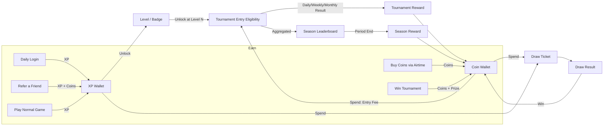
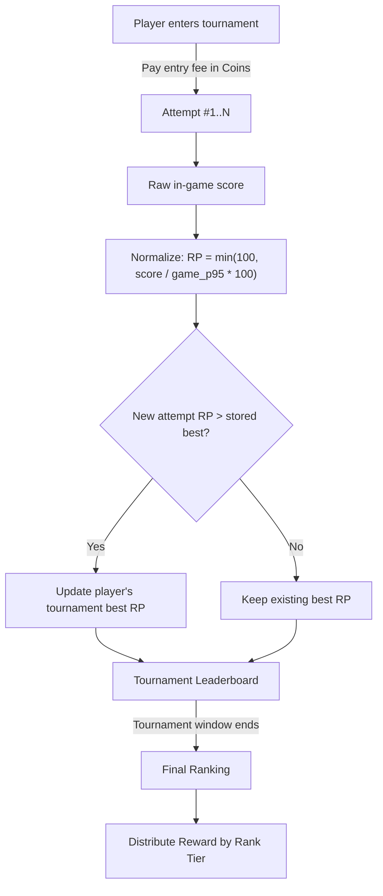
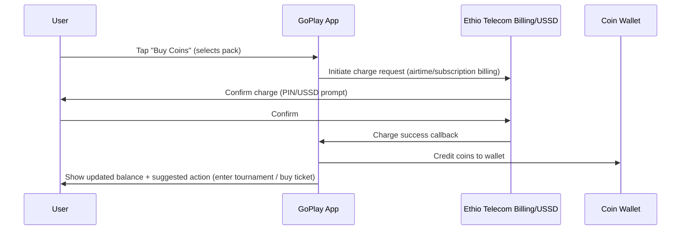
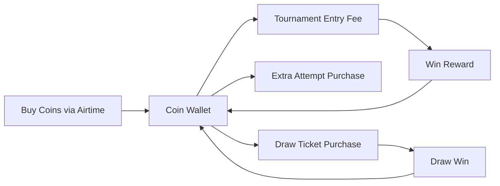

# GoPlay — Game Mechanics & Economy Design (v1)
**Scope:** Scoring, XP/Levels, Coins, Tournaments, Season Leaderboard, Draw Tickets
**Status:** Proposed finalized design

---

## 1. System Overview

GoPlay runs **two parallel tracks** that share one currency (Coins) but never share scoring:

- **Normal Games** → drive daily habit, give **XP** (progression, free)
- **Tournament Games** → drive competition + revenue, give **Score → Rank** (paid entry, real reward)

Both tracks feed a single **Draw/Raffle** system as a shared "consolation + extra excitement" outlet.



---

## 2. Currency & Progression Types

| Type | Earned from | Spent on | Tradeable for cash-value rewards? |
|---|---|---|---|
| **XP** | Normal games, daily login, referrals | Draw tickets, unlocking levels/badges/tournament access | No — purely progression |
| **Coins** | Buying with airtime, tournament/season/draw winnings | Tournament entry fees, extra tournament attempts, draw tickets | Yes — this is your revenue + reward currency |
| **Score (RP)** | Per-tournament gameplay only | Nothing — used only to rank that tournament | N/A |

 **XP never becomes Coins directly**, and **Score never becomes a permanent stat** — it resets per tournament.

---

## 3. Normal Games — XP & Levels

### 3.1 XP sources

| Source | XP Reward | Notes |
|---|---|---|
| Play a normal game (per session) | 10 XP × game difficulty multiplier (1.0 / 1.5 / 2.0 for Easy/Med/Hard) | Capped at **3 rewarded sessions/day per game** ; can still play unlimited, just no XP after cap |
| Daily login | Day 1: 5 XP → Day 7: 50 XP (escalating streak, resets if a day missed) | Drives daily-open habit |
| Refer a friend (friend installs + plays 1 game) | 100 XP + 20 Coins | One-time per successful referral; capped at e.g. 20 referrals counted/month to prevent abuse |

### 3.2 Level table (example curve — tune after soft launch)

| Level | XP Required (cumulative) | Unlocks |
|---|---|---|
| 1 | 0 | — |
| 2 | 150 | Badge: Rookie |
| 3 | 400 | Tournament category: **Daily Tournaments** |
| 4 | 800 | Badge: Regular |
| 5 | 1,500 | Tournament category: **Weekly Tournaments** |
| 7 | 3,000 | Badge: Veteran + 1 free tournament entry token |
| 10 | 6,000 | Tournament category: **Monthly Tournaments** + Badge: Elite |

This gives you a **soft funnel**: brand-new users start in free Normal Games, naturally levels up into Daily Tournaments, and only experienced/engaged users reach Monthly Tournaments.

### 3.3 XP → Draw Ticket conversion

- **1 Draw Ticket = 200 XP** (spent, not earned passively — this is a deliberate XP sink)
- Encourages players to keep playing Normal Games even after hitting a level cap, since XP still has a use.

---

## 4. Tournament Games — Scoring & Reward

### 4.1 Tournament types (independent scoring, never mixed)

| Type | Duration | Entry Fee (Coins) | Attempts allowed | Typical Reward Pool |
|---|---|---|---|---|
| **Daily** | 24h | 10 coins | 3 attempts, best score counts | Small/fast (coins + small airtime) |
| **Weekly** | 7 days | 30 coins | 5 attempts, best score counts | Medium (coins + data bundle) |
| **Monthly** | 30 days | 75 coins | 10 attempts, best score counts | Large (airtime/device/cash-equivalent) |

Each tournament instance is **scored independently** — a Daily tournament's leaderboard has nothing to do with a Weekly tournament's, even on the same game.

### 4.2 How score is calculated inside a tournament

Because different games have different raw score scales, raw scores are normalized into **Rank Points (RP)** so leaderboards stay fair and comparable:

```
RP (per attempt) = min(100, (raw_score / game_rolling_p95_score) × 100)
```

- `game_rolling_p95_score` = the 95th-percentile score for that specific game over its last ~500 plays (recalculated periodically) — this auto-adjusts as players get better at a game over time, so RP=100 stays meaningfully "elite," not a fixed ceiling that becomes trivial later.
- **Tournament Score = best RP across the player's allowed attempts** (per the attempts cap in §4.1)
- **Tie-break:** earliest timestamp of the best attempt wins (rewards decisiveness, discourages stalling until the last hour)




### 4.3 Reward tiers per tournament (example — Daily tournament, tune per budget)

| Rank | Reward |
|---|---|
| 1st | 200 Coins + 5 Draw Tickets |
| 2nd–3rd | 100 Coins + 2 Draw Tickets |
| 4th–10th | 30 Coins |
| 11th–50% of entrants | 5 Coins (consolation — keeps mid-tier players trying next time) |

Weekly/Monthly tiers scale up proportionally (e.g., Monthly 1st place could be airtime/data bundle worth significantly more, funded by the larger entry-fee pool).

**Reward funding logic :** Reward Pool = (Total entry fees collected for that tournament × payout %, e.g. 60–70%) + platform-funded top-up for the #1 prize, so prizes don't collapse if a tournament is low-entrant. This keeps tournaments self-funding as they scale while you guarantee an attractive top prize early on.

---

## 5. Season-Long Leaderboard (cross-tournament prestige)

Runs in parallel, e.g.quarterly, aggregating performance **across all tournaments in that period** — separate from any single tournament's own reward.

### 5.1 Calculation

```
Season Score (per player) = average of best RP from their N most recent tournament entries in the period
```

- Using an **average of best RPs**, not a sum, rewards consistency and skill rather than just entering the most tournaments — a player who enters 3 tournaments and dominates all 3 should be able to outrank someone who entered 30 and did mediocre each time.
- Minimum entry threshold (e.g., must have entered ≥3 tournaments in the period) to qualify, so the leaderboard can't be won by a single lucky tournament.

### 5.2 Season rewards 

| Season Rank | Reward |
|---|---|
| 1st | Airtime/Data bundle (large) + Elite Badge + 10 Draw Tickets |
| 2nd–5th | Medium airtime/data bundle + 5 Draw Tickets |
| 6th–20th | Coins (e.g. 300) + 2 Draw Tickets |
| Top 21–100 | Coins (e.g. 50) |

---

## 6. Draw / Raffle Tickets (shared outlet for everyone)

Most coin-buyers won't top a tournament, but draw tickets give every spend a continued chance at something, which keeps coin purchases attractive even after a loss.

### 6.1 Ticket sources

| Source | Ticket cost |
|---|---|
| Spend Coins | e.g. **20 Coins = 1 Ticket** |
| Spend XP | **200 XP = 1 Ticket** (from §3.3) |
| Tournament/Season rewards | Granted directly (see §4.4, §5.2) |

### 6.2 Draw mechanics
- Periodic draw (e.g. weekly), more tickets = more chances, but cap max tickets/draw per user (e.g. 50) to prevent one whale dominating the whole prize purely on spend.
- Prize: airtime/data bundles, partner merchandise, or a coin jackpot — funded by a small % of total coin-sales revenue + ticket-spend pool, similar logic to §4.4.

---

## 7. Coin Purchase Flow (revenue path — Ethio Telecom billing)



### 7.1 Suggested coin packs (tune to ARPU/price sensitivity)

| Pack | Price (ETB) | Coins | Bonus |
|---|---|---|---|
| Starter | 5 | 50 | — |
| Popular | 20 | 220 | +10% |
| Value | 50 | 600 | +20% |
| Pro | 100 | 1,300 | +30% |

Bonus tiers reward bigger purchases — standard practice that nudges average transaction size up.

### 7.2 Where Coins get used (full sink map)



**Hard rule:** Coins must never buy a direct score/performance boost (e.g. no "score multiplier" purchase). They can only buy **entry, attempts, or chances** — never the outcome itself. This is what keeps tournaments credible as "fair competitive ranking," which you said is the priority.

---

## 8. Source of Score / Where Score Is Used — Quick Reference

| Score Type | Where it comes from | Where it's used | Resets? |
|---|---|---|---|
| **Raw in-game score** | Player's live gameplay performance | Converted into RP (tournament) or XP (normal) — never shown/used directly outside its own session | Per session |
| **Rank Points (RP)** | Normalized raw score, per tournament attempt | Tournament leaderboard ranking only | Resets every new tournament instance |
| **Season Score** | Average of best RPs across qualifying tournaments in the period | Season leaderboard only | Resets every season period |
| **XP** | Normal game sessions, daily login, referrals | Levels, badges, tournament-tier unlocks, draw ticket purchase | Never resets (cumulative) |
| **Coins** | Purchases, tournament/season/draw rewards | Tournament entry, extra attempts, draw tickets | Never resets (wallet balance) |

---

